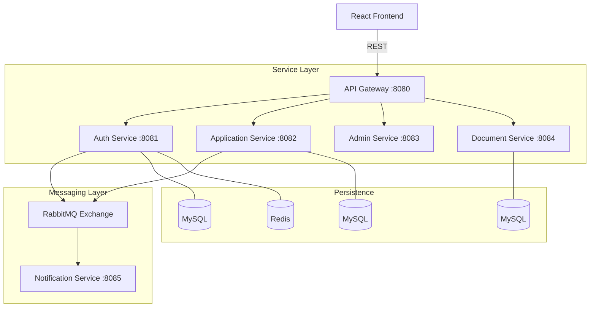
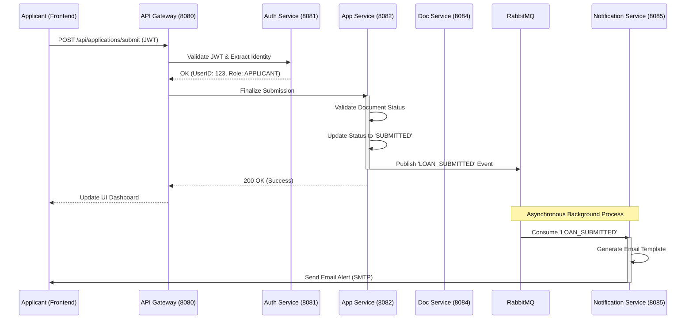
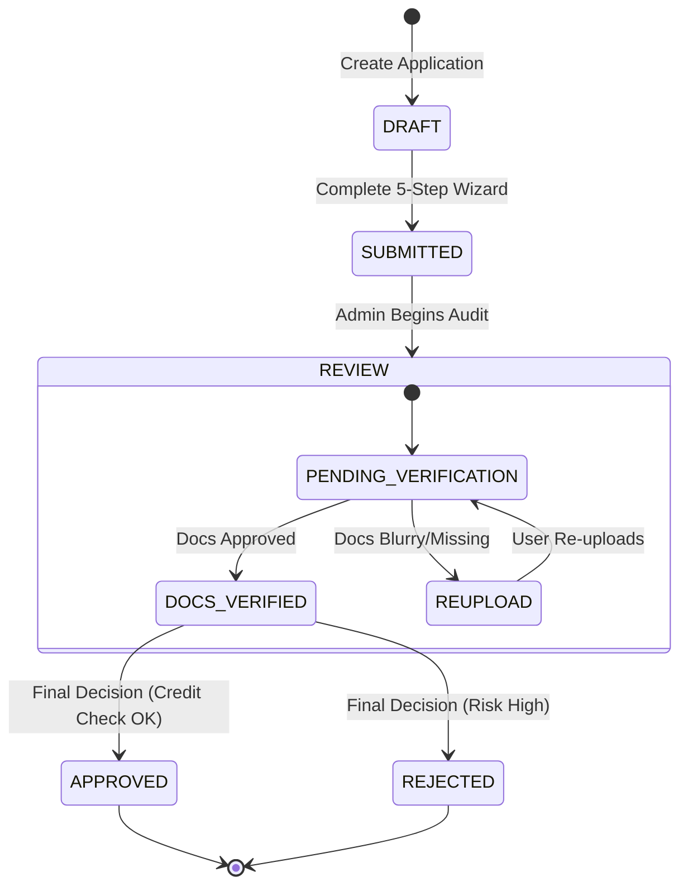

# 🏗️ System Architecture & Design

FinFlow is architected as a distributed system to ensure modularity, independent scalability, and high reliability. The following sections outline the core design principles and data flows.

---

## 🗺️ High-Level System Design

FinFlow follows a **Cloud-Native Microservices Architecture** designed for high availability, fault tolerance, and independent scalability.

---

## 🏎️ Detailed Operational Flows

### **1. End-to-End Loan Submission Sequence**
The following chart visualizes how a request travels through the microservice mesh, including security validation and asynchronous event propagation.

---

### **2. Loan Life-Cycle State Machine**
How the system manages the "Source of Truth" for an application status.

---

## ⚡ Core Operational Flows

### **1. Secure Onboarding & Authentication**
- **Identity Issuance**: The `Auth Service` handles registration and MFA. Upon success, it issues a signed JWT.
- **Edge Security**: The `API Gateway` validates the JWT for every request and injects user identity headers (Role, UserID) into the downstream request context.

### **2. Loan Application Lifecycle**
- **State Machine**: The `Application Service` manages the transition of an application through various states: `DRAFT` ➔ `SUBMITTED` ➔ `REVIEW` ➔ `DECISION`.
- **Validation**: Each step of the 5-step wizard is validated both on the client-side and at the service layer to ensure data integrity.

### **3. Document Orchestration**
- **Secure Mapping**: The `Document Service` manages metadata and links files to specific applications. 
- **Administrative Access**: Files are retrieved via secure endpoints that verify the requester's `ADMIN` role before granting access to the storage layer.

### **4. Event-Driven Notifications**
- **Decoupling**: To prevent blocking the main thread, all alerts (Email/In-App) are handled via **RabbitMQ**.
- **Execution**: Services publish events (e.g., `LOAN_APPROVED`) to the message broker, which the `Notification Service` consumes and processes in the background.

---

## 🛠️ Infrastructure & Observability

### **Service Governance**
- **Netflix Eureka**: Provides service discovery, allowing microservices to locate each other dynamically without hardcoded URLs.
- **Config Server**: Centralizes configuration (YAML/Properties) for all services, enabling environment-specific tuning.

### **Monitoring Stack**
- **Distributed Tracing**: Brave/Zipkin for visualizing the request path across service boundaries.
- **Metrics**: Micrometer and Prometheus for tracking system health and business KPIs.
- **Logging**: Grafana Loki for centralized, label-based log aggregation.

---

## 🔐 Design Principles
- **Database per Service**: Prevents tight coupling and ensures schema independence.
- **Statelessness**: No session data is stored on the server; all identity is carried by the JWT.
- **Idempotency**: All mutation requests (POST/PATCH) include a client-generated UUID to prevent duplicate operations in case of network retries.
