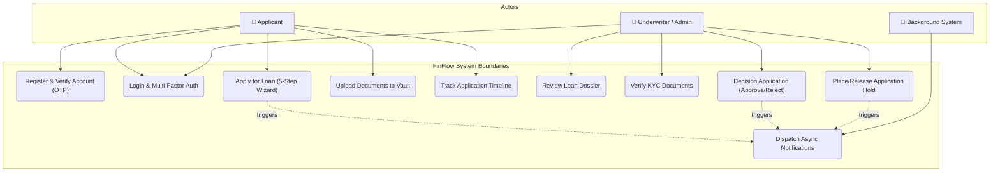
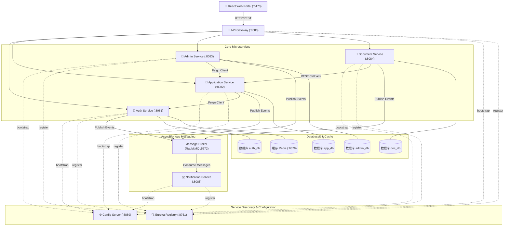
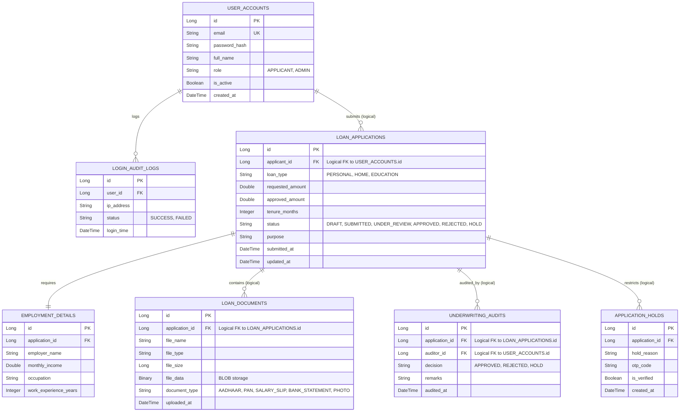
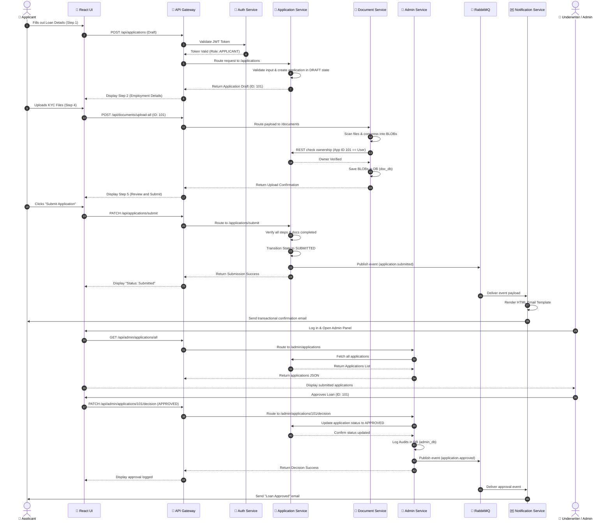
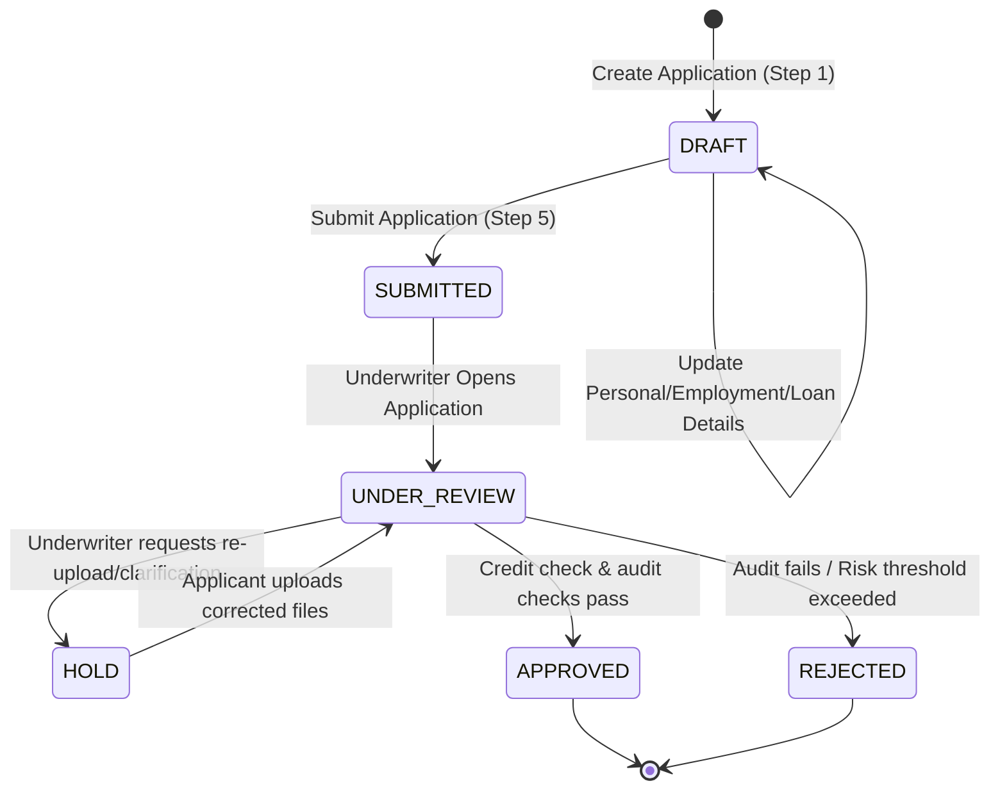

# 📊 FinFlow Design Diagrams & Flowcharts

This document provides the complete structural and behavioral blueprint of the FinFlow Enterprise Loan Management System.

---

## 1. Actor Use Case Diagram
This diagram illustrates the boundaries of the system and how different actors (Applicants, Underwriters/Admins, and System Services) interact with core capabilities.

---

## 2. Microservices Architecture
The system utilizes a **Database-per-Service** design, orchestrated via Spring Cloud Service Discovery (Eureka) and Config Server, and monitored through Loki, Prometheus, Grafana, and Zipkin.

---

## 3. Database Logical ERD (Database-per-Service Model)
Each microservice owns its schema. Integration across schemas is performed through **logical foreign keys** managed at the application level.

---

## 4. End-to-End Loan Flow (Sequence Diagram)
This diagram illustrates the chronological request-response lifecycle when an applicant creates, drafts, uploads documents, and submits a loan application, which is then decisioned by an administrator.

---

## 5. Loan Application State Machine Transition Diagram
The transition of a loan application status is strict. The diagram below shows allowed state transitions.

