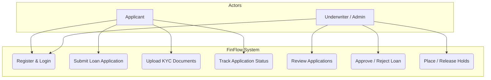
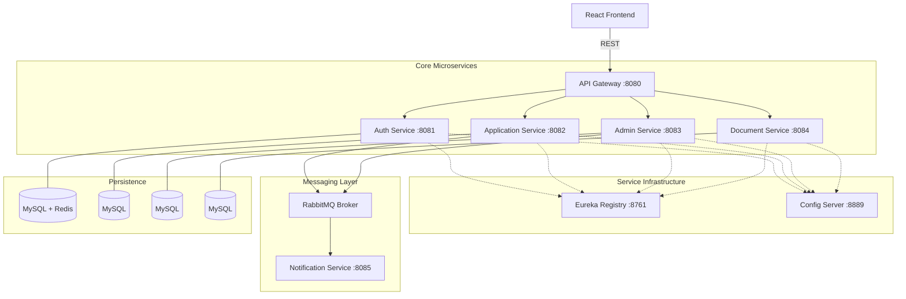
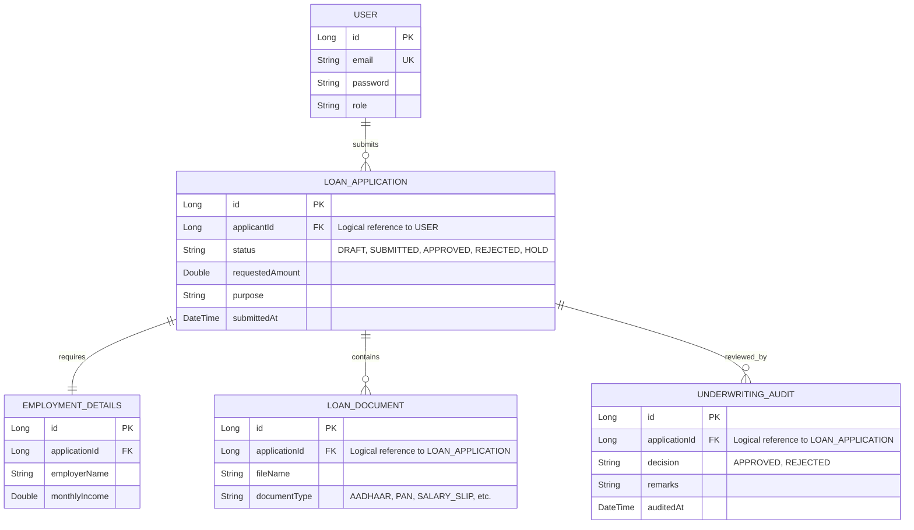
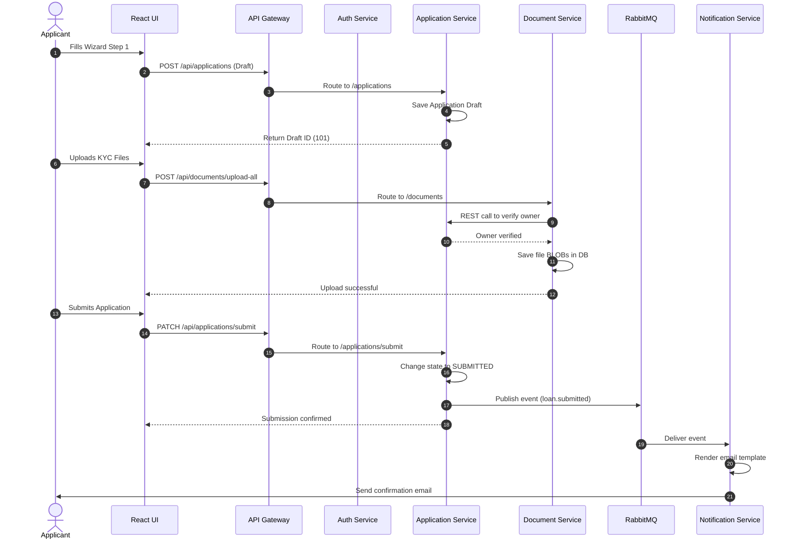
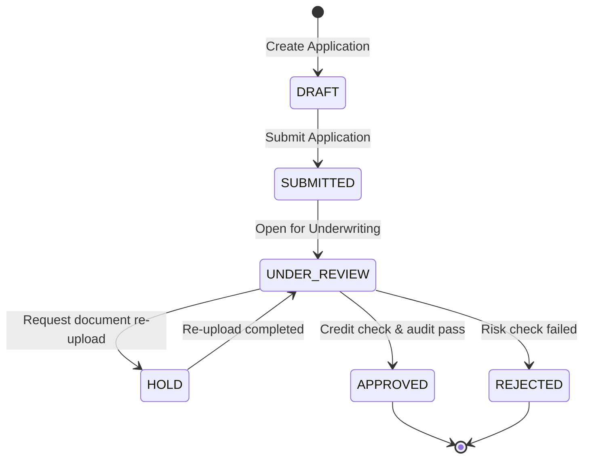

# 📊 FinFlow Design Diagrams

This document contains the structural and behavioral design diagrams for the FinFlow Loan Management System, illustrating both high-level architecture and detailed sequence flows.

---

## 1. Use Case Diagram
Illustrates the interactions between the actors (Applicant, Underwriter/Admin) and the boundaries of the system.

---

## 2. Microservices Architecture
Shows the service layout, gateway routing, Eureka registry, Config server, RabbitMQ message broker, and databases.

---

## 3. Database ERD (Logical Schema)
FinFlow follows a **Database-per-Service** model. Relationships across services are mapped logically via reference IDs.

---

## 4. End-to-End Loan Flow (Sequence Diagram)
Details the step-by-step HTTP requests, routing, event publishing, and DB logs when an applicant submits a loan and an admin decisions it.

---

## 5. Loan Application State Machine
Represents the allowed transitions of a loan application status.

