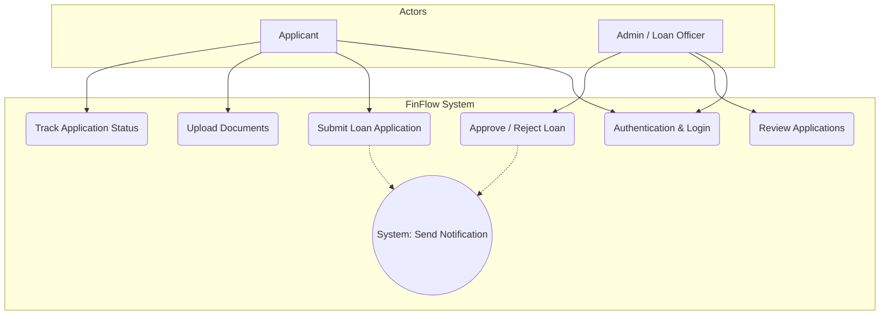
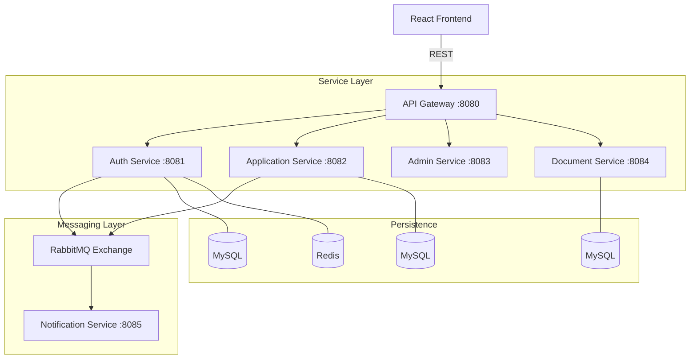
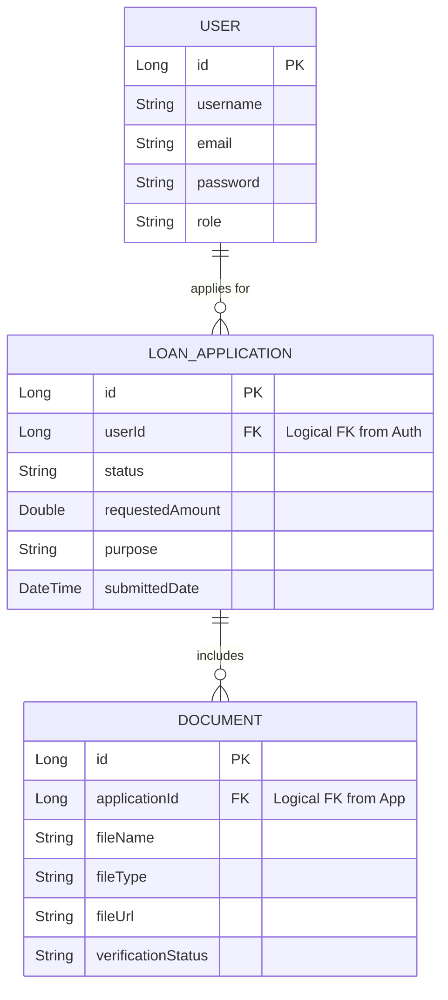

# 📊 FinFlow Design Diagrams

This document contains the design diagrams required for the project evaluation, covering the Use Case, Architecture, and Database diagrams.

---

## 1. Use Case Diagram
This diagram illustrates the interactions between the users (Applicant and Admin) and the FinFlow system.

---

## 2. System Architecture Diagram
This diagram shows the microservices architecture of FinFlow, including the API Gateway, service layer, messaging layer, and persistence layer.

---

## 3. Database Diagram (Logical ERD)
Since FinFlow follows a **Database-per-Service** pattern, these entities are managed by separate services but are logically related.

