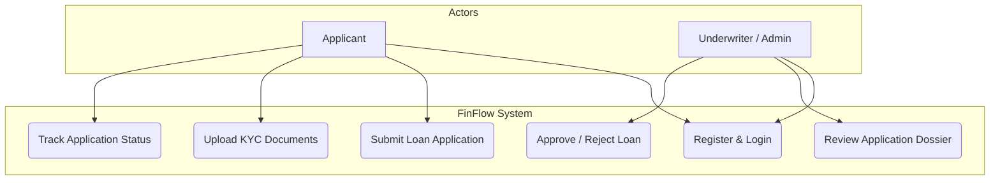
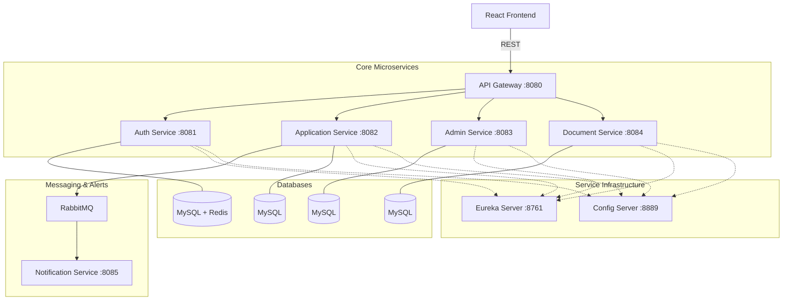
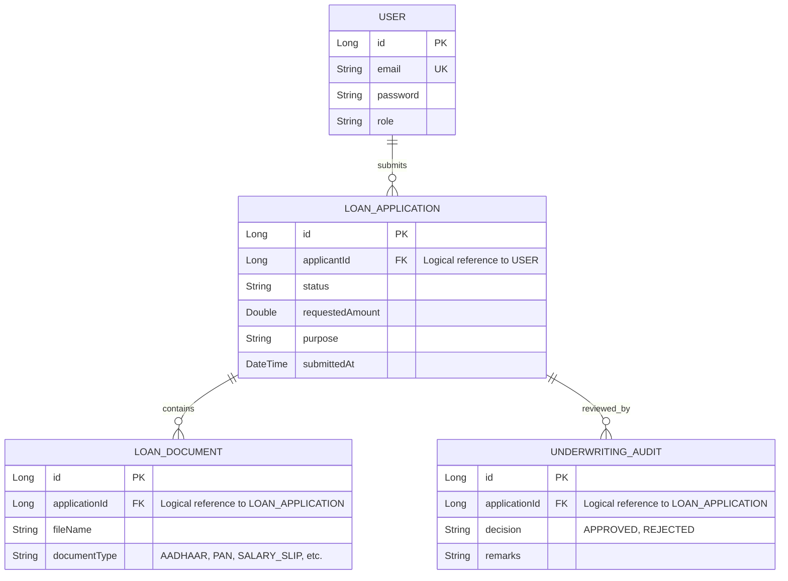
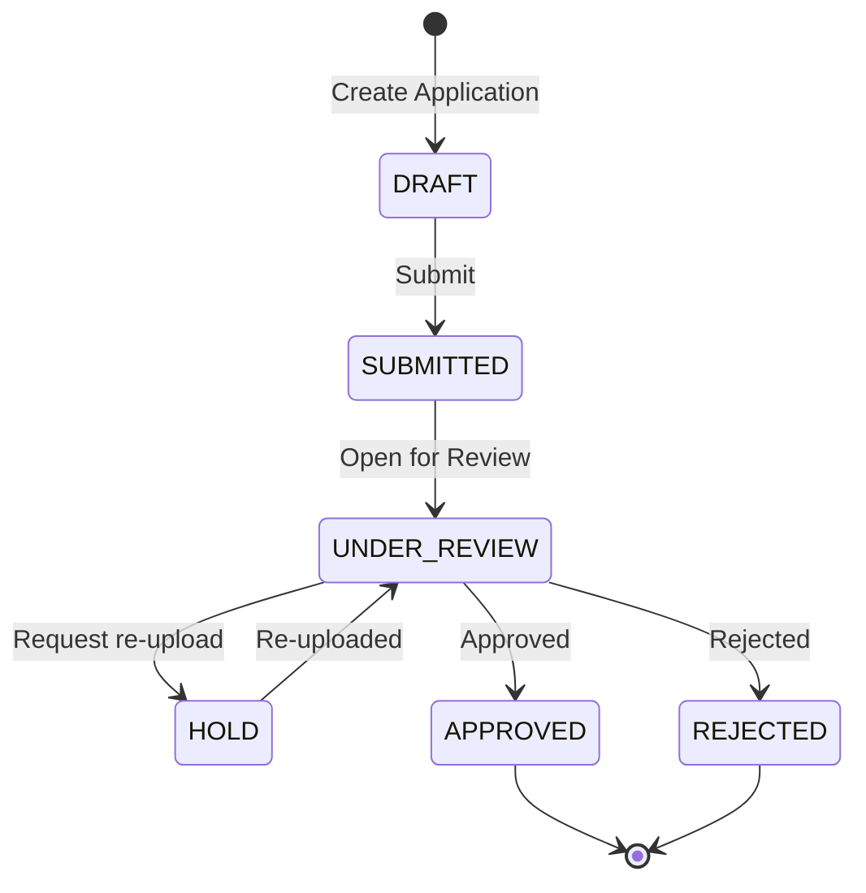

# 📊 FinFlow Design Diagrams

This document contains the core structural and behavioral diagrams for the FinFlow Loan Management System.

---

## 1. Use Case Diagram
Illustrates the interactions between the primary users (Applicant and Underwriter/Admin) and the core capabilities of the system.

---

## 2. System Architecture Diagram
Shows the microservices layout, edge gateway routing, discovery registry, messaging queue, and isolated databases.

---

## 3. Database ERD (Logical)
FinFlow uses a **Database-per-Service** pattern. Each service owns its database, and links are managed logically in the code using reference IDs.

---

## 4. Loan Application State Machine
Represents the strict lifecycle transitions that a loan application undergoes from creation to decision.

