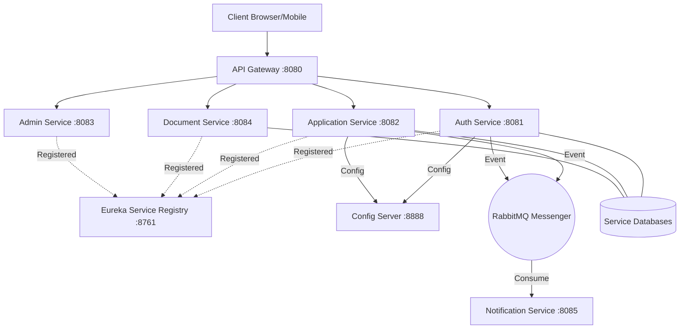

# ⚙️ FinFlow Backend - Microservices Infrastructure

[](https://spring.io/projects/spring-boot)
[](https://spring.io/projects/spring-cloud)
[](https://www.oracle.com/java/)
[](../LICENSE)

The **FinFlow Backend** is a cloud-native, microservices-based ecosystem designed for high-throughput financial transactions and robust data governance. It leverages the **Spring Cloud Ecosystem** to provide a resilient, observable, and scalable backbone for the FinFlow platform.

---

## 🏛️ Architecture & Data Flow

FinFlow leverages a multi-service architecture centered around the **Spring Cloud Ecosystem**.



---

## 🛠️ Microservice Breakdown

- **🔐 Auth Service (`:8081`)**: RBAC-based security using JWT. Handles user onboarding, MFA logic, and identity management.
- **📁 Document Service (`:8084`)**: Secure storage mapping and metadata management for loan-related documents.
- **📄 Application Service (`:8082`)**: The core domain handler; manages draft creation, state transitions, and validation.
- **👔 Admin Service (`:8083`)**: specialized portal service for administrative evaluation, auditing, and decisioning.
- **🔔 Notification Service (`:8085`)**: Asynchronous, event-driven service utilizing RabbitMQ for high-throughput email and in-app alerts.
- **🛠️ Config & Discovery**: Infrastructure services ensuring high availability (`Eureka`) and centralized governance (`Config Server`).

---

## 🚀 Key Technical Highlights

### 1. **Distributed Observability**
FinFlow implements a complete observability stack:
- **Distributed Tracing**: Micrometer Tracing with Zipkin for end-to-end request tracking.
- **Log Aggregation**: Grafana Loki for centralized, structured logging.
- **Metrics**: Prometheus scraping Actuator endpoints for real-time health data.

### 2. **Event-Driven Architecture**
Uses **RabbitMQ** to decouple heavy notification tasks from core transactions, ensuring low latency and high availability.

### 3. **Security & Compliance**
- **JWT Identity Pinning**: Preventing token replay attacks.
- **BCrypt Hashing**: Strong encryption for sensitive credentials.
- **Audit Trails**: Every state change in the system is logged with actor metadata.

---

## 🚦 System Initialization

### Prerequisites
- Java 17+
- Maven 3.8+
- MySQL, Redis, & RabbitMQ

### Build & Run
```bash
# Multi-module Build
mvn clean install -DskipTests

# Start the cluster (via root script)
./START_ALL.bat
```

---

## 📊 Monitoring Access

| Dashboard | URL |
| :--- | :--- |
| **Eureka Registry** | [http://localhost:8761](http://localhost:8761) |
| **Zipkin Tracing** | [http://localhost:9411](http://localhost:9411) |
| **Config Server** | [http://localhost:8888](http://localhost:8888) |
| **Loki Logs** | [http://localhost:3100](http://localhost:3100) |

---
Part of the **FinFlow** Ecosystem.
